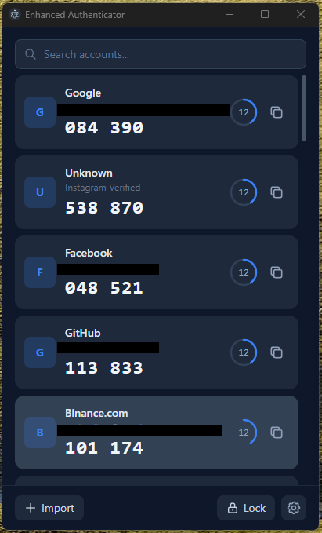

<p align="center">
  
</p>

<h1 align="center">Enhanced Authenticator</h1>

<p align="center">
  A cross-platform TOTP authenticator with encrypted local storage, biometric unlock, QR code support, and a built-in REST API.
</p>

<p align="center">
  
  
  
  
</p>

<p align="center">
  
</p>

---

## Features

- **Encrypted Vault** &mdash; AES-256-GCM encryption with PBKDF2 key derivation (600k iterations, SHA-512)
- **Biometric Unlock** &mdash; Windows Hello and Touch ID support
- **QR Code Import** &mdash; Scan via camera or upload an image file
- **QR Code Export** &mdash; Batch-aware carousel for Google Authenticator migration
- **Google Authenticator Compatible** &mdash; Full `otpauth-migration://` protobuf support (import & export)
- **System Tray** &mdash; Quick-copy TOTP codes from the tray menu, minimize to tray
- **REST API** &mdash; Localhost API with key authentication and rate limiting
- **CLI Client** &mdash; Command-line access to your TOTP codes
- **Clipboard Auto-Clear** &mdash; Automatically clears copied codes after a configurable timeout
- **Screenshot Protection** &mdash; Optional screen capture prevention
- **Persistent Window Position** &mdash; Remembers window size and position across sessions

## Quick Start

```bash
# Install dependencies
npm install

# Development
npm run dev

# Build
npm run build

# Preview production build
npm start
```

## Import & Export

### Import
- **Paste URI** &mdash; Paste `otpauth://` URIs (one per line) or `otpauth-migration://` links
- **Scan QR Code** &mdash; Use your camera or upload a QR code image

### Export
- **Encrypted Backup** &mdash; Password-protected `.eav` file
- **QR Code** &mdash; Scannable QR codes compatible with Google Authenticator (auto-batched for large vaults)

## REST API

The built-in API runs on `127.0.0.1:29170` when enabled in settings.

```bash
# Get all codes
curl -H "Authorization: Bearer YOUR_API_KEY" http://127.0.0.1:29170/codes

# Get a specific code
curl -H "Authorization: Bearer YOUR_API_KEY" http://127.0.0.1:29170/codes/:id
```

## Architecture

```
src/
  main/           Electron main process
    api/           REST API server
    autolock/      Idle monitoring & auto-lock
    biometric/     Windows Hello / Touch ID
    export/        Encrypted vault export
    ipc/           IPC handlers
    security/      AES-256-GCM, PBKDF2, secure memory
    totp/          TOTP engine, import parser, QR generator
    tray/          System tray integration
    vault/         Vault management
  preload/         Context bridge (sandboxed)
  renderer/        React UI
    components/    UI components
    hooks/         Custom React hooks
    store/         Zustand state management
  shared/          Shared types & constants
cli/               CLI client
```

## Security

- All secrets encrypted at rest with AES-256-GCM
- Key derivation: PBKDF2 with 600,000 iterations and SHA-512
- Sandboxed renderer with context isolation
- No remote code execution; all processing is local
- Automatic vault locking on idle
- Rate-limited API with authentication failure lockout

## License

MIT
